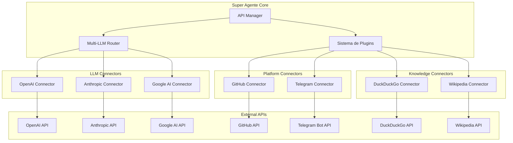

# Integraciones de APIs Principales - Conectores del Ecosistema

## Resumen Ejecutivo

Este documento especifica los conectores e integraciones para las APIs más críticas del ecosistema del Super Agente Multimodal y Modular. Los conectores están diseñados para integrarse perfectamente con el Multi-LLM Router y el sistema de plugins modulares existente, proporcionando un acceso unificado y eficiente a los servicios esenciales.

### APIs Principales Integradas

1. **LLM Providers**: OpenAI, Anthropic, Google - Modelos de lenguaje avanzados
2. **Desarrollo**: GitHub - Control de versiones y colaboración
3. **Comunicación**: Telegram - Bot y mensajería
4. **Búsqueda**: DuckDuckGo - Búsqueda web privada
5. **Conocimiento**: Wikipedia - Base de conocimiento enciclopédico

## 1. Arquitectura de Conectores

### 1.1 Diagrama de Arquitectura General



### 1.2 Principios de Diseño

**Modularidad**: Cada conector es un plugin independiente que puede ser activado/desactivado dinámicamente.

**Estandarización**: Todos los conectores implementan interfaces comunes para facilitar el intercambio y mantenimiento.

**Resiliencia**: Implementación de circuit breakers, retry logic y fallback mechanisms.

**Seguridad**: Gestión segura de API keys con rotación automática y cifrado en reposo.

**Observabilidad**: Métricas completas, logging estructurado y tracing distribuido.

## 2. Conectores para LLM Providers

### 2.1 OpenAI Connector

#### 2.1.1 Especificación Técnica

```python
class OpenAIConnector(BaseLLMConnector):
    """Conector optimizado para OpenAI GPT-4o y modelos derivados"""
    
    def __init__(self, config: OpenAIConfig):
        super().__init__(config)
        self.client = AsyncOpenAI(api_key=config.api_key)
        self.models = {
            "gpt-4o": {"context": 128000, "capabilities": ["text", "vision", "code"]},
            "gpt-4o-mini": {"context": 128000, "capabilities": ["text", "code"]},
            "gpt-3.5-turbo": {"context": 16385, "capabilities": ["text", "code"]}
        }
    
    async def generate_response(self, request: LLMRequest) -> LLMResponse:
        """Generación de respuesta con optimizaciones específicas"""
        try:
            # Optimización automática de prompt según modelo
            optimized_request = self.optimize_for_model(request)
            
            # Streaming para respuestas largas
            if request.stream:
                return await self.stream_response(optimized_request)
            
            # Respuesta estándar
            response = await self.client.chat.completions.create(
                model=optimized_request.model,
                messages=optimized_request.messages,
                temperature=optimized_request.temperature,
                max_tokens=optimized_request.max_tokens
            )
            
            return self.format_response(response)
            
        except OpenAIError as e:
            return self.handle_api_error(e)
    
    def get_capabilities(self) -> Dict[str, Any]:
        """Capacidades específicas de OpenAI"""
        return {
            "text_generation": True,
            "code_generation": True,
            "vision_analysis": True,
            "function_calling": True,
            "json_mode": True,
            "structured_output": True,
            "max_context": 128000,
            "supported_languages": "all"
        }
```

#### 2.1.2 Configuración y Optimizaciones

**Gestión de API Keys**:
```python
class OpenAIConfig:
    api_key: str = SecretStr()
    organization: Optional[str] = None
    rate_limits: Dict[str, int] = {
        "requests_per_minute": 500,
        "tokens_per_minute": 90000
    }
    retry_config: RetryConfig = RetryConfig(
        max_attempts=3,
        backoff_factor=2.0,
        jitter=True
    )
```

**Optimizaciones de Rendimiento**:
- Pool de conexiones reutilizables
- Caché inteligente de respuestas frecuentes  
- Compresión automática de prompts largos
- Batch processing para múltiples requests

### 2.2 Anthropic Connector

#### 2.2.1 Especificación Técnica

```python
class AnthropicConnector(BaseLLMConnector):
    """Conector optimizado para Claude 3.5 Sonnet y familia Claude"""
    
    def __init__(self, config: AnthropicConfig):
        super().__init__(config)
        self.client = AsyncAnthropic(api_key=config.api_key)
        self.models = {
            "claude-3-5-sonnet-20241022": {
                "context": 200000, 
                "capabilities": ["text", "vision", "reasoning", "code"],
                "specialty": "reasoning_tasks"
            },
            "claude-3-haiku-20240307": {
                "context": 200000,
                "capabilities": ["text", "code"],
                "specialty": "speed_tasks"
            }
        }
    
    async def generate_response(self, request: LLMRequest) -> LLMResponse:
        """Generación optimizada para Claude con técnicas específicas"""
        try:
            # Optimización de prompt para Claude
            claude_request = self.adapt_for_claude(request)
            
            # Uso de system prompts optimizados
            response = await self.client.messages.create(
                model=claude_request.model,
                system=claude_request.system_prompt,
                messages=claude_request.messages,
                temperature=claude_request.temperature,
                max_tokens=claude_request.max_tokens
            )
            
            return self.format_claude_response(response)
            
        except AnthropicError as e:
            return self.handle_api_error(e)
    
    def adapt_for_claude(self, request: LLMRequest) -> ClaudeRequest:
        """Adaptaciones específicas para Claude"""
        # Claude prefiere XML tags para estructuración
        # Separación clara de system vs user prompts
        # Optimización de reasoning tasks
        pass
```

#### 2.2.2 Características Especiales

**Reasoning Enhancement**:
- Técnicas de prompting específicas para razonamiento complejo
- Chain-of-thought optimization para Claude
- Structured thinking templates

**Vision Processing**:
- Análisis optimizado de imágenes con Claude
- Multi-image processing capabilities  
- Document analysis integration

### 2.3 Google AI Connector

#### 2.3.1 Especificación Técnica

```python
class GoogleAIConnector(BaseLLMConnector):
    """Conector para Google Gemini Pro y modelos derivados"""
    
    def __init__(self, config: GoogleAIConfig):
        super().__init__(config)
        self.client = genai.GenerativeModel(
            model_name=config.model_name,
            generation_config=config.generation_config
        )
        self.models = {
            "gemini-1.5-pro": {
                "context": 2000000,  # 2M tokens
                "capabilities": ["text", "vision", "audio", "video", "code"],
                "specialty": "multimodal_tasks"
            },
            "gemini-1.5-flash": {
                "context": 1000000,
                "capabilities": ["text", "vision", "code"],
                "specialty": "speed_tasks"
            }
        }
    
    async def generate_response(self, request: LLMRequest) -> LLMResponse:
        """Generación con capacidades multimodales avanzadas"""
        try:
            # Procesamiento multimodal
            if request.has_media():
                return await self.process_multimodal(request)
            
            # Generación de texto estándar
            response = await self.client.generate_content_async(
                contents=self.format_for_gemini(request),
                generation_config=request.generation_config
            )
            
            return self.format_gemini_response(response)
            
        except Exception as e:
            return self.handle_api_error(e)
    
    async def process_multimodal(self, request: LLMRequest) -> LLMResponse:
        """Procesamiento avanzado multimodal"""
        contents = []
        
        # Procesamiento de texto
        if request.text:
            contents.append(request.text)
        
        # Procesamiento de imágenes
        for image in request.images:
            contents.append(await self.process_image(image))
        
        # Procesamiento de audio/video
        for media in request.media:
            contents.append(await self.process_media(media))
        
        return await self.generate_multimodal_response(contents)
```

## 3. Conectores para Plataformas de Desarrollo

### 3.1 GitHub Connector

#### 3.1.1 Especificación Técnica

```python
class GitHubConnector(BasePluginConnector):
    """Conector completo para GitHub API con capacidades de desarrollo"""
    
    def __init__(self, config: GitHubConfig):
        super().__init__(config)
        self.client = Github(auth=Auth.Token(config.token))
        self.capabilities = {
            "repository_management": True,
            "code_analysis": True,
            "pull_request_automation": True,
            "issue_tracking": True,
            "ci_cd_integration": True,
            "code_review": True
        }
    
    async def analyze_repository(self, repo_url: str) -> RepositoryAnalysis:
        """Análisis completo de repositorio"""
        repo = self.client.get_repo(self.extract_repo_path(repo_url))
        
        analysis = RepositoryAnalysis(
            structure=await self.analyze_structure(repo),
            dependencies=await self.analyze_dependencies(repo),
            code_quality=await self.analyze_code_quality(repo),
            activity=await self.analyze_activity(repo),
            security=await self.analyze_security(repo)
        )
        
        return analysis
    
    async def create_pull_request(self, 
                                request: PullRequestRequest) -> PullRequestResponse:
        """Creación automatizada de pull requests"""
        repo = self.client.get_repo(request.repository)
        
        # Creación de branch
        source_ref = repo.get_git_ref(f"heads/{request.base_branch}")
        repo.create_git_ref(
            ref=f"refs/heads/{request.feature_branch}",
            sha=source_ref.object.sha
        )
        
        # Commit de cambios
        for file_change in request.file_changes:
            await self.commit_file_change(repo, file_change)
        
        # Creación del PR
        pr = repo.create_pull(
            title=request.title,
            body=request.description,
            head=request.feature_branch,
            base=request.base_branch
        )
        
        return PullRequestResponse(
            number=pr.number,
            url=pr.html_url,
            status="created"
        )
    
    async def automated_code_review(self, pr_number: int, 
                                  repo_path: str) -> CodeReviewResult:
        """Review automatizado de código con AI"""
        repo = self.client.get_repo(repo_path)
        pr = repo.get_pull(pr_number)
        
        # Obtener cambios
        files = pr.get_files()
        
        reviews = []
        for file in files:
            if file.status in ['added', 'modified']:
                # Análisis con LLM especializado en código
                llm_review = await self.llm_router.route_request(
                    LLMRequest(
                        task_type="code_review",
                        content=file.patch,
                        context={
                            "filename": file.filename,
                            "language": self.detect_language(file.filename)
                        }
                    )
                )
                
                reviews.append(FileReview(
                    filename=file.filename,
                    suggestions=llm_review.suggestions,
                    issues=llm_review.issues,
                    score=llm_review.quality_score
                ))
        
        return CodeReviewResult(
            pr_number=pr_number,
            file_reviews=reviews,
            overall_score=self.calculate_overall_score(reviews),
            recommendations=self.generate_recommendations(reviews)
        )
```

#### 3.1.2 Integración con Multi-LLM Router

```python
class GitHubLLMIntegration:
    """Integración específica de GitHub con el Multi-LLM Router"""
    
    def __init__(self, github_connector: GitHubConnector, 
                 llm_router: MultiLLMRouter):
        self.github = github_connector
        self.llm_router = llm_router
    
    async def smart_commit_generation(self, changes: List[FileChange]) -> str:
        """Generación inteligente de mensajes de commit"""
        # Análisis de cambios con modelo especializado
        analysis_request = LLMRequest(
            task_type="code_analysis",
            model_preference="claude",  # Claude es excelente para código
            content=self.format_changes_for_analysis(changes)
        )
        
        analysis = await self.llm_router.route_request(analysis_request)
        
        # Generación de commit message
        commit_request = LLMRequest(
            task_type="commit_message_generation",
            model_preference="gpt-4o",
            content=analysis.summary,
            context={
                "convention": "conventional_commits",
                "scope": analysis.scope,
                "type": analysis.change_type
            }
        )
        
        return await self.llm_router.route_request(commit_request)
    
    async def generate_documentation(self, repo_path: str) -> DocumentationSet:
        """Generación automática de documentación"""
        # Análisis de estructura del repositorio
        structure = await self.github.analyze_repository_structure(repo_path)
        
        # Generación de README con modelo multimodal
        readme_request = LLMRequest(
            task_type="documentation_generation",
            model_preference="gemini",  # Gemini para docs comprehensivas
            content={
                "structure": structure,
                "type": "README"
            }
        )
        
        readme = await self.llm_router.route_request(readme_request)
        
        # Generación de API docs con Claude
        api_docs_request = LLMRequest(
            task_type="api_documentation",
            model_preference="claude",
            content=await self.extract_api_endpoints(repo_path)
        )
        
        api_docs = await self.llm_router.route_request(api_docs_request)
        
        return DocumentationSet(
            readme=readme,
            api_docs=api_docs,
            changelog=await self.generate_changelog(repo_path)
        )
```

### 3.2 Capacidades Avanzadas de GitHub

#### 3.2.1 CI/CD Integration

```python
class GitHubCICDConnector(GitHubConnector):
    """Extensión para integración con CI/CD"""
    
    async def setup_github_actions(self, repo_path: str, 
                                 workflow_config: WorkflowConfig) -> WorkflowSetup:
        """Setup automatizado de GitHub Actions"""
        repo = self.client.get_repo(repo_path)
        
        # Generación de workflow con LLM
        workflow_request = LLMRequest(
            task_type="workflow_generation",
            model_preference="claude",
            content={
                "project_type": workflow_config.project_type,
                "tech_stack": workflow_config.tech_stack,
                "deployment_target": workflow_config.deployment_target
            }
        )
        
        workflow_yaml = await self.llm_router.route_request(workflow_request)
        
        # Creación del archivo de workflow
        repo.create_file(
            path=f".github/workflows/{workflow_config.name}.yml",
            message=f"Add {workflow_config.name} workflow",
            content=workflow_yaml.content
        )
        
        return WorkflowSetup(
            name=workflow_config.name,
            file_path=f".github/workflows/{workflow_config.name}.yml",
            status="created"
        )
```

## 4. Conectores de Comunicación

### 4.1 Telegram Connector

#### 4.1.1 Especificación Técnica

```python
class TelegramConnector(BasePluginConnector):
    """Conector completo para Telegram Bot API con capacidades avanzadas"""
    
    def __init__(self, config: TelegramConfig):
        super().__init__(config)
        self.bot = Bot(token=config.bot_token)
        self.application = Application.builder().token(config.bot_token).build()
        self.capabilities = {
            "text_messaging": True,
            "media_processing": True,
            "file_handling": True,
            "inline_keyboards": True,
            "group_management": True,
            "webhook_support": True,
            "payments": True
        }
        self.setup_handlers()
    
    def setup_handlers(self):
        """Configuración de handlers del bot"""
        self.application.add_handler(
            CommandHandler("start", self.handle_start)
        )
        self.application.add_handler(
            MessageHandler(filters.TEXT, self.handle_message)
        )
        self.application.add_handler(
            MessageHandler(filters.PHOTO, self.handle_image)
        )
        self.application.add_handler(
            MessageHandler(filters.VOICE, self.handle_voice)
        )
        self.application.add_handler(
            CallbackQueryHandler(self.handle_callback)
        )
    
    async def handle_message(self, update: Update, context: ContextTypes.DEFAULT_TYPE):
        """Procesamiento inteligente de mensajes con LLM"""
        user_message = update.message.text
        user_id = update.effective_user.id
        
        # Análisis de intención del mensaje
        intent_request = LLMRequest(
            task_type="intent_analysis",
            model_preference="gpt-4o-mini",  # Rápido para análisis de intent
            content=user_message,
            context={
                "user_id": user_id,
                "chat_type": update.effective_chat.type
            }
        )
        
        intent = await self.llm_router.route_request(intent_request)
        
        # Routing a handler específico basado en intención
        handler = self.get_intent_handler(intent.category)
        response = await handler.process(user_message, intent, update)
        
        # Envío de respuesta
        await update.message.reply_text(
            text=response.text,
            reply_markup=response.keyboard,
            parse_mode=ParseMode.MARKDOWN
        )
    
    async def handle_image(self, update: Update, context: ContextTypes.DEFAULT_TYPE):
        """Procesamiento inteligente de imágenes"""
        photo = update.message.photo[-1]  # Máxima resolución
        
        # Descarga de imagen
        file = await context.bot.get_file(photo.file_id)
        image_bytes = await file.download_as_bytearray()
        
        # Análisis con modelo de visión
        vision_request = LLMRequest(
            task_type="image_analysis",
            model_preference="gemini",  # Gemini excelente para visión
            content={
                "image": image_bytes,
                "caption": update.message.caption or ""
            }
        )
        
        analysis = await self.llm_router.route_request(vision_request)
        
        # Respuesta contextual
        await update.message.reply_text(
            f"🖼️ **Análisis de Imagen:**\n\n{analysis.description}\n\n"
            f"**Objetos detectados:** {', '.join(analysis.objects)}\n"
            f"**Confianza:** {analysis.confidence:.1%}",
            parse_mode=ParseMode.MARKDOWN
        )
    
    async def create_interactive_bot(self, bot_config: BotConfig) -> TelegramBot:
        """Creación de bot interactivo personalizado"""
        # Generación de personalidad del bot con LLM
        personality_request = LLMRequest(
            task_type="bot_personality_generation",
            model_preference="claude",
            content={
                "bot_purpose": bot_config.purpose,
                "target_audience": bot_config.audience,
                "tone": bot_config.tone,
                "capabilities": bot_config.capabilities
            }
        )
        
        personality = await self.llm_router.route_request(personality_request)
        
        # Configuración del bot
        bot_instance = TelegramBot(
            token=self.config.bot_token,
            personality=personality,
            handlers=self.generate_handlers(bot_config),
            commands=self.generate_commands(bot_config)
        )
        
        return bot_instance
```

#### 4.1.2 Capacidades Multimodales

```python
class TelegramMultimodalProcessor:
    """Procesador multimodal para Telegram"""
    
    def __init__(self, telegram_connector: TelegramConnector,
                 llm_router: MultiLLMRouter):
        self.telegram = telegram_connector
        self.llm_router = llm_router
    
    async def process_voice_message(self, voice_file: Voice) -> VoiceResponse:
        """Procesamiento de mensajes de voz"""
        # Conversión de voz a texto
        audio_data = await self.download_voice(voice_file)
        
        speech_to_text_request = LLMRequest(
            task_type="speech_to_text",
            model_preference="openai",  # Whisper integration
            content=audio_data
        )
        
        transcript = await self.llm_router.route_request(speech_to_text_request)
        
        # Procesamiento del texto transcrito
        response_request = LLMRequest(
            task_type="conversational_response",
            model_preference="claude",
            content=transcript.text,
            context={"input_type": "voice"}
        )
        
        text_response = await self.llm_router.route_request(response_request)
        
        # Opcionalmente, conversión de texto a voz
        if self.config.voice_responses_enabled:
            tts_request = LLMRequest(
                task_type="text_to_speech",
                model_preference="openai",
                content=text_response.text
            )
            
            audio_response = await self.llm_router.route_request(tts_request)
            
            return VoiceResponse(
                transcript=transcript.text,
                text_response=text_response.text,
                audio_response=audio_response.audio_data
            )
        
        return VoiceResponse(
            transcript=transcript.text,
            text_response=text_response.text
        )
```

## 5. Conectores de Búsqueda y Conocimiento

### 5.1 DuckDuckGo Connector

#### 5.1.1 Especificación Técnica

```python
class DuckDuckGoConnector(BasePluginConnector):
    """Conector para búsqueda web privada con DuckDuckGo"""
    
    def __init__(self, config: DuckDuckGoConfig):
        super().__init__(config)
        self.client = DDGS()
        self.capabilities = {
            "web_search": True,
            "image_search": True,
            "video_search": True,
            "news_search": True,
            "map_search": True,
            "privacy_focused": True
        }
    
    async def search_web(self, query: str, 
                        options: SearchOptions = None) -> SearchResults:
        """Búsqueda web inteligente con procesamiento LLM"""
        options = options or SearchOptions()
        
        # Optimización de query con LLM
        query_optimization_request = LLMRequest(
            task_type="search_query_optimization",
            model_preference="gpt-4o-mini",
            content=query,
            context={
                "search_engine": "duckduckgo",
                "max_results": options.max_results,
                "region": options.region
            }
        )
        
        optimized_query = await self.llm_router.route_request(query_optimization_request)
        
        # Búsqueda con DuckDuckGo
        raw_results = self.client.text(
            keywords=optimized_query.query,
            region=options.region,
            safesearch=options.safesearch,
            max_results=options.max_results
        )
        
        # Procesamiento y síntesis de resultados
        synthesis_request = LLMRequest(
            task_type="search_results_synthesis",
            model_preference="claude",  # Excelente para síntesis
            content={
                "query": query,
                "results": raw_results,
                "synthesis_type": options.synthesis_type
            }
        )
        
        synthesis = await self.llm_router.route_request(synthesis_request)
        
        return SearchResults(
            original_query=query,
            optimized_query=optimized_query.query,
            raw_results=raw_results,
            synthesis=synthesis,
            metadata={
                "search_time": time.time(),
                "results_count": len(raw_results),
                "privacy_level": "high"
            }
        )
    
    async def research_assistant(self, topic: str, 
                               depth: ResearchDepth = ResearchDepth.MEDIUM) -> ResearchReport:
        """Asistente de investigación avanzado"""
        # Generación de plan de investigación
        research_plan_request = LLMRequest(
            task_type="research_planning",
            model_preference="claude",
            content=topic,
            context={"depth": depth.value}
        )
        
        research_plan = await self.llm_router.route_request(research_plan_request)
        
        # Ejecución de búsquedas múltiples
        search_results = []
        for query in research_plan.search_queries:
            result = await self.search_web(
                query, 
                SearchOptions(
                    max_results=depth.max_results_per_query,
                    synthesis_type="detailed"
                )
            )
            search_results.append(result)
        
        # Compilación de reporte final
        report_generation_request = LLMRequest(
            task_type="research_report_generation",
            model_preference="claude",  # Excelente para reportes largos
            content={
                "topic": topic,
                "search_results": search_results,
                "plan": research_plan
            }
        )
        
        final_report = await self.llm_router.route_request(report_generation_request)
        
        return ResearchReport(
            topic=topic,
            executive_summary=final_report.executive_summary,
            detailed_analysis=final_report.detailed_analysis,
            sources=self.extract_sources(search_results),
            confidence_score=final_report.confidence_score,
            generated_at=datetime.utcnow()
        )
```

#### 5.1.2 Búsqueda Multimodal

```python
class DuckDuckGoMultimodalSearch:
    """Capacidades de búsqueda multimodal"""
    
    async def search_images_with_analysis(self, query: str) -> ImageSearchResults:
        """Búsqueda de imágenes con análisis inteligente"""
        # Búsqueda de imágenes
        image_results = self.client.images(
            keywords=query,
            max_results=20
        )
        
        # Análisis de imágenes relevantes
        analyzed_images = []
        for img in image_results[:5]:  # Analizar las 5 mejores
            analysis_request = LLMRequest(
                task_type="image_relevance_analysis",
                model_preference="gemini",
                content={
                    "image_url": img["image"],
                    "query": query,
                    "metadata": img
                }
            )
            
            analysis = await self.llm_router.route_request(analysis_request)
            analyzed_images.append({
                **img,
                "relevance_score": analysis.relevance_score,
                "description": analysis.description,
                "tags": analysis.tags
            })
        
        return ImageSearchResults(
            query=query,
            total_results=len(image_results),
            analyzed_results=analyzed_images,
            recommendations=self.generate_image_recommendations(analyzed_images)
        )
```

### 5.2 Wikipedia Connector

#### 5.2.1 Especificación Técnica

```python
class WikipediaConnector(BasePluginConnector):
    """Conector inteligente para Wikipedia con capacidades de procesamiento avanzado"""
    
    def __init__(self, config: WikipediaConfig):
        super().__init__(config)
        self.wikipedia = wikipedia
        self.wikipedia.set_lang(config.language)
        self.capabilities = {
            "article_retrieval": True,
            "content_summarization": True,
            "fact_extraction": True,
            "cross_reference": True,
            "multi_language": True,
            "structured_data": True
        }
    
    async def get_comprehensive_info(self, topic: str) -> WikipediaInfo:
        """Obtención de información comprehensiva sobre un tema"""
        try:
            # Búsqueda inicial
            search_results = self.wikipedia.search(topic, results=10)
            
            if not search_results:
                return WikipediaInfo(
                    topic=topic,
                    found=False,
                    message="No se encontró información"
                )
            
            # Obtención del artículo principal
            main_page = self.wikipedia.page(search_results[0])
            
            # Procesamiento del contenido con LLM
            content_processing_request = LLMRequest(
                task_type="wikipedia_content_processing",
                model_preference="claude",  # Excelente para textos largos
                content={
                    "title": main_page.title,
                    "content": main_page.content,
                    "summary": main_page.summary,
                    "query": topic
                }
            )
            
            processed_content = await self.llm_router.route_request(content_processing_request)
            
            # Extracción de datos estructurados
            structured_data = await self.extract_structured_data(main_page)
            
            # Búsqueda de artículos relacionados
            related_articles = await self.get_related_articles(topic, search_results[1:5])
            
            return WikipediaInfo(
                topic=topic,
                found=True,
                main_article=ArticleInfo(
                    title=main_page.title,
                    url=main_page.url,
                    summary=processed_content.enhanced_summary,
                    key_points=processed_content.key_points,
                    categories=main_page.categories,
                    references=main_page.references
                ),
                structured_data=structured_data,
                related_articles=related_articles,
                confidence_score=processed_content.confidence_score
            )
            
        except wikipedia.exceptions.DisambiguationError as e:
            return await self.handle_disambiguation(topic, e.options)
        except wikipedia.exceptions.PageError:
            return WikipediaInfo(
                topic=topic,
                found=False,
                message="Página no encontrada"
            )
    
    async def fact_check_with_wikipedia(self, claim: str) -> FactCheckResult:
        """Verificación de hechos usando Wikipedia como fuente"""
        # Extracción de entidades del claim
        entity_extraction_request = LLMRequest(
            task_type="entity_extraction",
            model_preference="gpt-4o",
            content=claim
        )
        
        entities = await self.llm_router.route_request(entity_extraction_request)
        
        # Búsqueda de información para cada entidad
        evidence = []
        for entity in entities.entities:
            info = await self.get_comprehensive_info(entity.name)
            if info.found:
                evidence.append(info)
        
        # Análisis de fact-checking
        fact_check_request = LLMRequest(
            task_type="fact_checking",
            model_preference="claude",
            content={
                "claim": claim,
                "evidence": evidence,
                "entities": entities
            }
        )
        
        result = await self.llm_router.route_request(fact_check_request)
        
        return FactCheckResult(
            claim=claim,
            verdict=result.verdict,  # True, False, Partially True, Unclear
            confidence=result.confidence,
            explanation=result.explanation,
            supporting_evidence=result.supporting_evidence,
            contradicting_evidence=result.contradicting_evidence,
            sources=evidence
        )
    
    async def create_knowledge_graph(self, topic: str, 
                                   depth: int = 2) -> KnowledgeGraph:
        """Creación de grafo de conocimiento desde Wikipedia"""
        visited = set()
        graph = nx.DiGraph()
        
        await self._build_knowledge_graph_recursive(topic, depth, visited, graph)
        
        # Análisis del grafo con LLM
        graph_analysis_request = LLMRequest(
            task_type="knowledge_graph_analysis",
            model_preference="claude",
            content={
                "topic": topic,
                "nodes": list(graph.nodes(data=True)),
                "edges": list(graph.edges(data=True)),
                "metrics": {
                    "node_count": graph.number_of_nodes(),
                    "edge_count": graph.number_of_edges(),
                    "density": nx.density(graph)
                }
            }
        )
        
        analysis = await self.llm_router.route_request(graph_analysis_request)
        
        return KnowledgeGraph(
            topic=topic,
            graph=graph,
            insights=analysis.insights,
            key_relationships=analysis.key_relationships,
            central_concepts=analysis.central_concepts
        )
```

## 6. Gestión de API Keys y Configuración

### 6.1 API Key Manager Avanzado

```python
class APIKeyManager:
    """Gestor avanzado de API keys con rotación automática y seguridad"""
    
    def __init__(self, config: APIKeyManagerConfig):
        self.vault = SecureVault(config.vault_config)
        self.rotation_scheduler = RotationScheduler()
        self.usage_monitor = UsageMonitor()
        
    async def setup_all_apis(self) -> SetupResult:
        """Configuración automática de todas las APIs"""
        setup_tasks = [
            self.setup_openai_api(),
            self.setup_anthropic_api(),
            self.setup_google_api(),
            self.setup_github_api(),
            self.setup_telegram_api()
        ]
        
        results = await asyncio.gather(*setup_tasks, return_exceptions=True)
        
        return SetupResult(
            successful=[r for r in results if not isinstance(r, Exception)],
            failed=[r for r in results if isinstance(r, Exception)],
            summary=self.generate_setup_summary(results)
        )
    
    async def setup_openai_api(self) -> APISetupResult:
        """Configuración específica para OpenAI"""
        try:
            # Verificación de API key existente
            existing_key = await self.vault.get_key("openai_api_key")
            
            if existing_key and await self.validate_openai_key(existing_key):
                return APISetupResult(
                    provider="openai",
                    status="already_configured",
                    key_valid=True
                )
            
            # Solicitud de nueva API key al usuario si es necesario
            if not existing_key:
                new_key = await self.request_api_key_from_user(
                    provider="openai",
                    instructions="Obtén tu API key desde https://platform.openai.com/api-keys"
                )
                await self.vault.store_key("openai_api_key", new_key)
            
            # Configuración de rate limits y políticas
            await self.configure_rate_limits("openai", {
                "requests_per_minute": 500,
                "tokens_per_minute": 90000
            })
            
            # Setup de monitoring
            await self.setup_usage_monitoring("openai")
            
            return APISetupResult(
                provider="openai",
                status="configured",
                key_valid=True,
                features_enabled=["gpt-4o", "gpt-4o-mini", "vision", "function_calling"]
            )
            
        except Exception as e:
            return APISetupResult(
                provider="openai",
                status="error",
                error=str(e)
            )
```

### 6.2 Configuración de Conectores

```python
class ConnectorConfigurationManager:
    """Gestor de configuración para todos los conectores"""
    
    def __init__(self):
        self.configs = {}
        self.templates = self.load_config_templates()
    
    async def generate_optimal_configs(self) -> Dict[str, ConnectorConfig]:
        """Generación automática de configuraciones optimales"""
        # Generación con LLM basada en el entorno y requisitos
        config_generation_request = LLMRequest(
            task_type="connector_configuration_generation",
            model_preference="claude",
            content={
                "connectors": ["openai", "anthropic", "google", "github", "telegram", 
                             "duckduckgo", "wikipedia"],
                "environment": self.detect_environment(),
                "performance_requirements": self.analyze_performance_requirements(),
                "security_requirements": self.analyze_security_requirements()
            }
        )
        
        generated_configs = await self.llm_router.route_request(config_generation_request)
        
        return generated_configs.configs
    
    def get_connector_config(self, connector_name: str) -> ConnectorConfig:
        """Obtención de configuración optimizada por conector"""
        base_config = self.templates[connector_name]
        
        # Personalización basada en uso y métricas
        if connector_name in self.usage_history:
            base_config = self.optimize_based_on_usage(base_config, connector_name)
        
        return base_config
```

## 7. Monitoreo y Observabilidad

### 7.1 Sistema de Métricas

```python
class ConnectorMetricsCollector:
    """Recolector de métricas para todos los conectores"""
    
    def __init__(self):
        self.metrics_store = MetricsStore()
        self.alerting = AlertingSystem()
    
    async def collect_llm_metrics(self, connector_name: str, 
                                request: LLMRequest, 
                                response: LLMResponse) -> None:
        """Recolección de métricas para conectores LLM"""
        metrics = LLMMetrics(
            connector=connector_name,
            model=request.model,
            tokens_input=request.token_count,
            tokens_output=response.token_count,
            latency=response.processing_time,
            cost=self.calculate_cost(request, response),
            success=response.success,
            error_type=response.error_type if not response.success else None
        )
        
        await self.metrics_store.store(metrics)
        
        # Alertas automáticas
        if metrics.latency > self.thresholds.latency_threshold:
            await self.alerting.send_alert(
                AlertType.HIGH_LATENCY,
                f"High latency detected for {connector_name}: {metrics.latency}ms"
            )
    
    async def generate_performance_report(self, 
                                        timeframe: str = "24h") -> PerformanceReport:
        """Generación de reporte de rendimiento"""
        metrics = await self.metrics_store.get_metrics(timeframe)
        
        # Análisis con LLM
        analysis_request = LLMRequest(
            task_type="performance_analysis",
            model_preference="claude",
            content={
                "metrics": metrics,
                "timeframe": timeframe,
                "connectors": list(set(m.connector for m in metrics))
            }
        )
        
        analysis = await self.llm_router.route_request(analysis_request)
        
        return PerformanceReport(
            timeframe=timeframe,
            summary=analysis.summary,
            key_insights=analysis.key_insights,
            recommendations=analysis.recommendations,
            metrics_summary=self.calculate_metrics_summary(metrics)
        )
```

## 8. Integración con Multi-LLM Router

### 8.1 Routing Inteligente por Conector

```python
class ConnectorAwareLLMRouter(MultiLLMRouter):
    """Router LLM con consciencia de conectores"""
    
    def __init__(self, config: LLMRouterConfig):
        super().__init__(config)
        self.connector_preferences = {
            "github": {"code_tasks": "claude", "documentation": "gpt-4o"},
            "telegram": {"conversational": "gpt-4o", "image_analysis": "gemini"},
            "duckduckgo": {"query_optimization": "gpt-4o-mini", "synthesis": "claude"},
            "wikipedia": {"content_processing": "claude", "fact_checking": "gpt-4o"}
        }
    
    async def route_connector_request(self, 
                                    connector_name: str,
                                    request: LLMRequest) -> LLMResponse:
        """Routing optimizado basado en el conector origen"""
        
        # Selección de modelo basada en conector y tarea
        if connector_name in self.connector_preferences:
            task_preferences = self.connector_preferences[connector_name]
            
            if request.task_type in task_preferences:
                request.model_preference = task_preferences[request.task_type]
        
        # Optimización específica por conector
        optimized_request = await self.optimize_for_connector(request, connector_name)
        
        # Routing normal con optimizaciones
        return await self.route_request(optimized_request)
    
    async def optimize_for_connector(self, 
                                   request: LLMRequest, 
                                   connector_name: str) -> LLMRequest:
        """Optimizaciones específicas por conector"""
        
        optimizations = {
            "github": self.optimize_for_github,
            "telegram": self.optimize_for_telegram,
            "wikipedia": self.optimize_for_wikipedia
        }
        
        if connector_name in optimizations:
            return await optimizations[connector_name](request)
        
        return request
```

## 9. Casos de Uso Avanzados

### 9.1 Flujo Integrado: Investigación → Desarrollo → Comunicación

```python
class IntegratedWorkflow:
    """Flujo de trabajo integrado usando múltiples conectores"""
    
    def __init__(self, connectors: Dict[str, BaseConnector]):
        self.connectors = connectors
        self.llm_router = MultiLLMRouter()
    
    async def research_to_implementation_flow(self, 
                                            topic: str,
                                            repo_url: str,
                                            telegram_chat_id: str) -> WorkflowResult:
        """Flujo completo: investigación → implementación → notificación"""
        
        # 1. Investigación inicial
        research = await self.connectors["duckduckgo"].research_assistant(
            topic, ResearchDepth.DEEP
        )
        
        wiki_info = await self.connectors["wikipedia"].get_comprehensive_info(topic)
        
        # 2. Análisis del repositorio
        repo_analysis = await self.connectors["github"].analyze_repository(repo_url)
        
        # 3. Generación de plan de implementación
        implementation_plan = await self.llm_router.route_request(
            LLMRequest(
                task_type="implementation_planning",
                model_preference="claude",
                content={
                    "research": research,
                    "wiki_info": wiki_info,
                    "repo_analysis": repo_analysis,
                    "topic": topic
                }
            )
        )
        
        # 4. Implementación automática
        implementation_result = await self.connectors["github"].implement_feature(
            repo_url, implementation_plan
        )
        
        # 5. Notificación via Telegram
        await self.connectors["telegram"].send_message(
            chat_id=telegram_chat_id,
            message=f"🚀 **Implementación Completada**\n\n"
                   f"**Tema:** {topic}\n"
                   f"**PR:** {implementation_result.pull_request_url}\n"
                   f"**Estado:** {implementation_result.status}"
        )
        
        return WorkflowResult(
            research_summary=research.executive_summary,
            implementation_url=implementation_result.pull_request_url,
            notification_sent=True
        )
```

## 10. Conclusiones y Próximos Pasos

### 10.1 Beneficios de la Arquitectura de Conectores

**Modularidad**: Cada conector es independiente y puede desarrollarse/mantenerse por separado.

**Escalabilidad**: Fácil adición de nuevos conectores sin afectar la arquitectura central.

**Inteligencia**: Integración profunda con el Multi-LLM Router para optimización automática.

**Observabilidad**: Métricas completas y monitoreo en tiempo real de todos los conectores.

### 10.2 Roadmap de Desarrollo

**Fase 1** (Completada): Arquitectura y especificaciones técnicas
**Fase 2**: Implementación de conectores LLM (OpenAI, Anthropic, Google)
**Fase 3**: Implementación de conectores de plataforma (GitHub, Telegram)
**Fase 4**: Implementación de conectores de conocimiento (DuckDuckGo, Wikipedia)
**Fase 5**: Testing, optimización y deployment

### 10.3 Consideraciones de Seguridad

- Cifrado end-to-end de API keys
- Rotación automática de credenciales
- Audit logging de todas las operaciones
- Sandboxing de plugins de terceros
- Rate limiting inteligente
- Validación de inputs/outputs

### 10.4 Métricas de Éxito

- **Latencia promedio** < 500ms para operaciones estándar
- **Disponibilidad** > 99.9% para conectores críticos
- **Precisión de routing** > 95% en selección de modelos
- **Eficiencia de costos** 30% reducción vs implementación individual
- **Satisfacción del desarrollador** medida via feedback y métricas de uso

---

**Documento generado el:** 2025-09-07  
**Versión:** 1.0  
**Autor:** Super Agente Multimodal - Arquitectura de Conectores  
**Próxima revisión:** Implementación de Fase 2